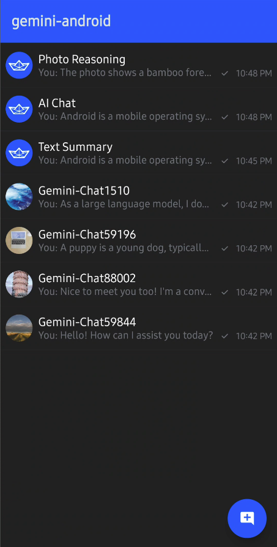
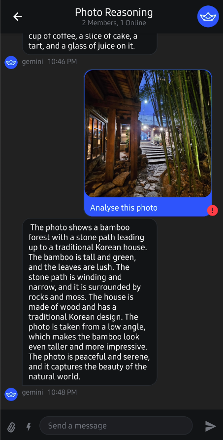
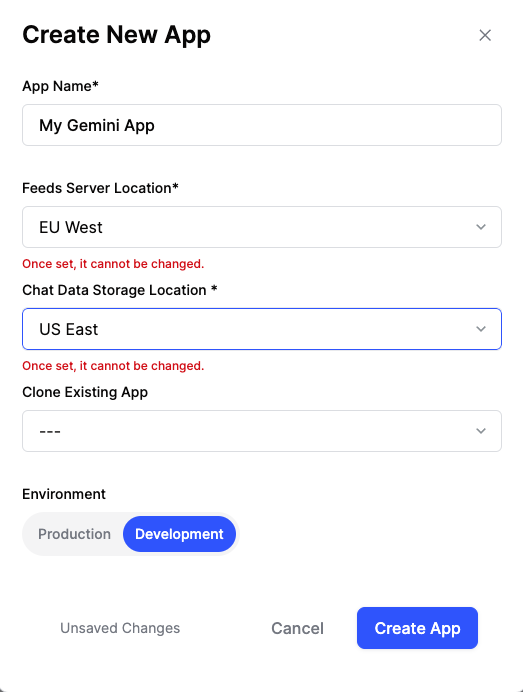
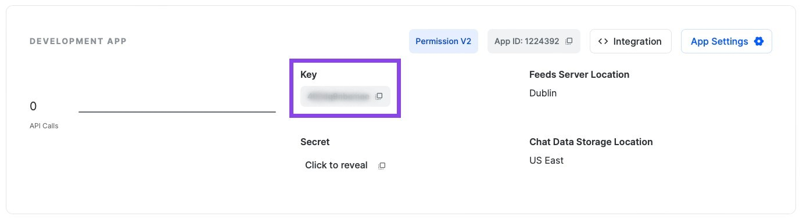
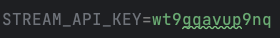
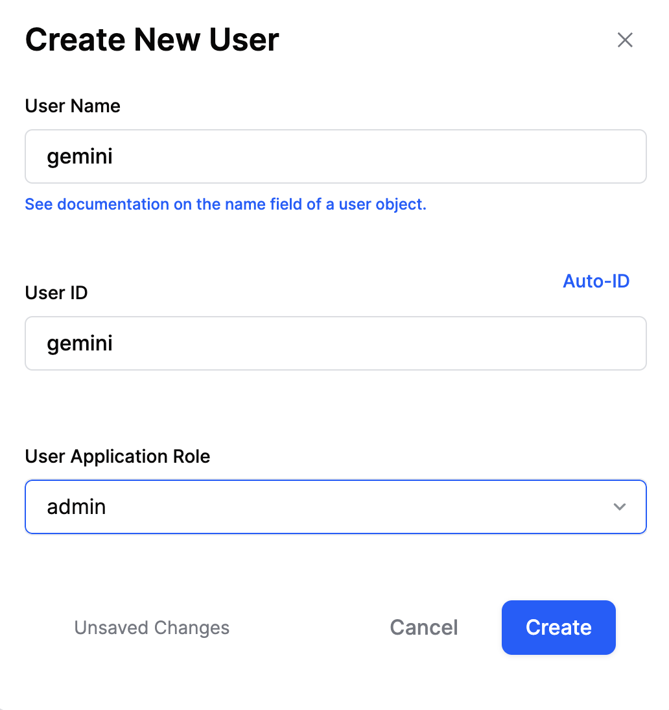
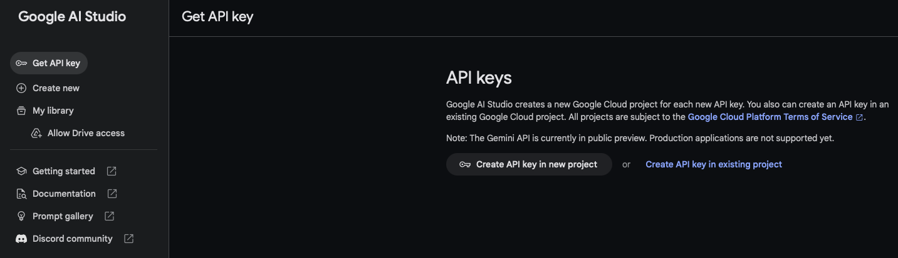
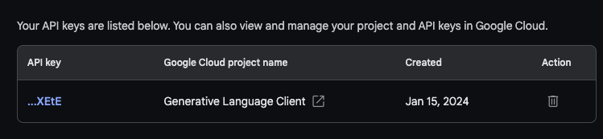
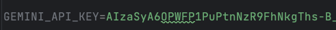

<p align="center">
  <a href="https://opensource.org/licenses/Apache-2.0"></a>
  <a href="https://android-arsenal.com/api?level=21"></a>
  <a href="https://github.com/skydoves/gemini-android/actions/workflows/android.yml"></a>
  <a href="https://github.com/skydoves"></a>
</p>

**Gemini Android** demonstrates [Google's Generative AI](https://android-developers.googleblog.com/2023/12/leverage-generative-ai-in-your-android-apps.html) on Android with [Stream Chat SDK for Compose](https://getstream.io/tutorials/android-chat?utm_source=Github&utm_medium=Github_Repo_Content_Ad&utm_content=Developer&utm_campaign=Github_Dec2024_Jaewoong_Gemini&utm_term=DevRelOss).

The purpose of this repository is to demonstrate below:

- Demonstrates [Gemini API](https://ai.google.dev/tutorials/android_quickstart) for Android.
- Implementing entire UI elements with Jetpack Compose.
- Implementation of Android architecture components with Jetpack libraries such as Hilt and AppStartup.
- Performing background tasks with Kotlin Coroutines.
- Integrating chat systems with [Stream Chat Compose SDK](https://getstream.io/tutorials/android-chat?utm_source=Github&utm_medium=Github_Repo_Content_Ad&utm_content=Developer&utm_campaign=Github_Dec2024_Jaewoong_Gemini&utm_term=DevRelOss) for real-time event handling.

## 📷 Previews

<p align="center">


</br>
</p>

<a href="https://getstream.io/chat/sdk/compose?utm_source=Github&utm_medium=Github_Repo_Content_Ad&utm_content=Developer&utm_campaign=Github_Dec2024_Jaewoong_Gemini&utm_term=DevRelOs">

</a>

## 🛥 Stream Chat & Video SDK

**Gemini Android** is built with __[Stream Chat SDK for Compose](https://getstream.io/chat/sdk/compose?utm_source=Github&utm_medium=Github_Repo_Content_Ad&utm_content=Developer&utm_campaign=Github_Dec2024_Jaewoong_Gemini&utm_term=DevRelOss)__ to implement messaging systems. If you’re interested in building powerful real-time video/audio calling, audio room, and livestreaming, check out the __[Stream Video SDK for Compose](https://getstream.io/video/docs/android/tutorials/video-calling?utm_source=Github&utm_medium=Github_Repo_Content_Ad&utm_content=Developer&utm_campaign=Github_Dec2024_Jaewoong_Gemini&utm_term=DevRelOss)__!

### Stream Chat

- [Stream Chat SDK for Android on GitHub](https://github.com/getStream/stream-chat-android)
- [Android Samples for Stream Chat SDK on GitHub](https://github.com/getStream/android-samples)
- [Stream Chat Compose UI Components Guidelines](https://getstream.io/chat/docs/sdk/android/compose/overview/)

### Stream Video

- [Stream Video SDK for Android on GitHub](https://github.com/getstream/stream-video-android?utm_source=Github&utm_medium=Github_Repo_Content_Ad&utm_content=Developer&utm_campaign=Github_Dec2024_Jaewoong_Gemini&utm_term=DevRelOss)
- [Video Call Tutorial](https://getstream.io/video/docs/android/tutorials/video-calling?utm_source=Github&utm_medium=Github_Repo_Content_Ad&utm_content=Developer&utm_campaign=Github_Dec2024_Jaewoong_Gemini&utm_term=DevRelOss)
- [Audio Room Tutorial](https://getstream.io/video/docs/android/tutorials/audio-room?utm_source=Github&utm_medium=Github_Repo_Content_Ad&utm_content=Developer&utm_campaign=Github_Dec2024_Jaewoong_Gemini&utm_term=DevRelOss)
- [Livestream Tutorial](https://getstream.io/video/docs/android/tutorials/livestream?utm_source=Github&utm_medium=Github_Repo_Content_Ad&utm_content=Developer&utm_campaign=Github_Dec2024_Jaewoong_Gemini&utm_term=DevRelOss)

## 💻 How to build the project?

To build this project properly, you should follow the instructions below: 

1. Go to the __[Stream login page](https://getstream.io/try-for-free?utm_source=Github?utm_source=Github&utm_medium=Github_Repo_Content_Ad&utm_content=Developer&utm_campaign=Github_Dec2024_Jaewoong_Gemini&utm_term=DevRelOss)__.
2. If you have your GitHub account, click the **SIGN UP WITH GITHUB** button and you can sign up within a couple of seconds. 


3. If you don't have a GitHub account, fill in the inputs and click the **START FREE TRIAL** button.
4. Go to the __[Dashboard](https://dashboard.getstream.io?utm_source=Github?utm_source=Github&utm_medium=Github_Repo_Content_Ad&utm_content=Developer&utm_campaign=Github_Dec2024_Jaewoong_Gemini&utm_term=DevRelOss)__ and click the **Create App** button like the below.


5. Fill in the blanks like the below and click the **Create App** button.



6. You will see the **Key** like the image below and then copy it.



7. Create a new file named **secrets.properties** on the root directory of this Android project, and add the key to the `secrets.properties` file like the below:



```gradle
STREAM_API_KEY=..
```

8. Go to your __[Dashboard](https://dashboard.getstream.io?utm_source=Github?utm_source=Github&utm_medium=Github_Repo_Content_Ad&utm_content=Developer&utm_campaign=Github_Dec2024_Jaewoong_Gemini&utm_term=DevRelOss)__ again and click your App.

9. In the **Overview** menu, you can find the **Authentication** category by scrolling to the middle of the page.

10. Switch on the **Disable Auth Checks** option and click the **Submit** button like the image below.


11. Click the **Explorer** tab on the left side menu.

12. Click **users** -> **Create New User** button sequentially and add fill in the user like the below:



- User Name: `gemini`
- User ID: `gemini`

13. Go to **[Google AI Studio](https://makersuite.google.com/app/apikey)**, login with your Google account and select the **Get API key** on the menu left like the image below:



14. Create your API key for using generative AI SDKs, and you'll get one like the image below:



15. Add the key to the `secrets.properties` file like the below:



```gradle
GEMINI_API_KEY=..
```

16. Build and run the project.


## 🛠 Tech Stack & Open Source Libraries
- Minimum SDK level 21.
- 100% [Jetpack Compose](https://developer.android.com/jetpack/compose) based + [Coroutines](https://github.com/Kotlin/kotlinx.coroutines) + [Flow](https://kotlin.github.io/kotlinx.coroutines/kotlinx-coroutines-core/kotlinx.coroutines.flow/) for asynchronous.
- [Compose Chat SDK for Messaging](https://getstream.io/chat/sdk/compose?utm_source=Github?utm_source=Github&utm_medium=Github_Repo_Content_Ad&utm_content=Developer&utm_campaign=Github_Dec2024_Jaewoong_Gemini&utm_term=DevRelOss): The Jetpack Compose Chat Messaging SDK is built on a low-level chat client and provides modular, customizable Compose UI components that you can easily drop into your app.
- Jetpack
  - Compose: Android’s modern toolkit for building native UI.
  - ViewModel: UI related data holder and lifecycle aware.
  - App Startup: Provides a straightforward, performant way to initialize components at application startup.
  - Navigation: For navigating screens and [Hilt Navigation Compose](https://developer.android.com/jetpack/compose/libraries#hilt) for injecting dependencies.
  - Room: Constructs Database by providing an abstraction layer over SQLite to allow fluent database access.
  - Datastore: Store data asynchronously, consistently, and transactionally, overcoming some of the drawbacks of SharedPreferences.
  - [Hilt](https://dagger.dev/hilt/): Dependency Injection.
- [Landscapist Glide](https://github.com/skydoves/landscapist#glide), [animation](https://github.com/skydoves/landscapist#animation), [placeholder](https://github.com/skydoves/landscapist#placeholder): Jetpack Compose image loading library that fetches and displays network images with Glide, Coil, and Fresco.
- [Retrofit2 & OkHttp3](https://github.com/square/retrofit): Construct the REST APIs and paging network data.
- [Sandwich](https://github.com/skydoves/Sandwich): Construct a lightweight and modern response interface to handle network payload for Android.
- [Moshi](https://github.com/square/moshi/): A modern JSON library for Kotlin and Java.
- [ksp](https://github.com/google/ksp): Kotlin Symbol Processing API.
- [Balloon](https://github.com/skydoves/balloon): Modernized and sophisticated tooltips, fully customizable with an arrow and animations for Android.
- [StreamLog](https://github.com/GetStream/stream-log): A lightweight and extensible logger library for Kotlin and Android.
- Baseline Profiles: To improve app performance by including a list of classes and methods specifications in your APK that can be used by Android Runtime.

## 🏛️ Architecture

**Gemini Android** follows the [Google's official architecture guidance](https://developer.android.com/topic/architecture).


**Gemini Android** was built with [Guide to app architecture](https://developer.android.com/topic/architecture), so it would be a great sample to show how the architecture works in real-world projects.<br>

The overall architecture is composed of two layers; UI Layer and the data layer. Each layer has dedicated components and they each have different responsibilities.
The arrow means the component has a dependency on the target component following its direction.

### Architecture Overview


Each layer has different responsibilities below. Basically, they follow [unidirectional event/data flow](https://developer.android.com/topic/architecture/ui-layer#udf).

### UI Layer


The UI Layer consists of UI elements like buttons, menus, tabs that could interact with users and [ViewModel](https://developer.android.com/topic/libraries/architecture/viewmodel) that holds app states and restores data when configuration changes.

### Data Layer


The data Layer consists of repositories, which include business logic, such as querying data from the local database and requesting remote data from the network. It is implemented as an offline-first source of business logic and follows the [single source of truth](https://en.wikipedia.org/wiki/Single_source_of_truth) principle.<br>

For more information about the overall architecture, check out **[Build a Real-Time WhatsApp Clone With Jetpack Compose](https://getstream.io/blog/build-whatsapp-clone/)**.

## Modularization

**Gemini Android** has implemented the following modularization strategies:

- **Reusability**: By effectively modularizing reusable code, it not only facilitates code sharing but also restricts code access across different modules.

- **Parallel Building**: Modules are capable of being built in parallel, leading to reduced overall build time.

- **Decentralized Focusing**: Individual development teams are allocated specific modules, allowing them to concentrate on their designated areas.


## 💯 MAD Score


## 🤝 Contribution

Most of the features are not completed except the chat feature, so anyone can contribute and improve this project following the [Contributing Guideline](https://github.com/skydoves/gemini-android/blob/main/CONTRIBUTING.md).

## Find this repository useful? 💙
Support it by joining __[stargazers](https://github.com/skydoves/gemini-android/stargazers)__ for this repository. :star: <br>
Also, __[follow me](https://github.com/skydoves)__ on GitHub for my next creations! 🤩

# License
```xml
Designed and developed by 2024 skydoves (Jaewoong Eum)

Licensed under the Apache License, Version 2.0 (the "License");
you may not use this file except in compliance with the License.
You may obtain a copy of the License at

   http://www.apache.org/licenses/LICENSE-2.0

Unless required by applicable law or agreed to in writing, software
distributed under the License is distributed on an "AS IS" BASIS,
WITHOUT WARRANTIES OR CONDITIONS OF ANY KIND, either express or implied.
See the License for the specific language governing permissions and
limitations under the License.
```
